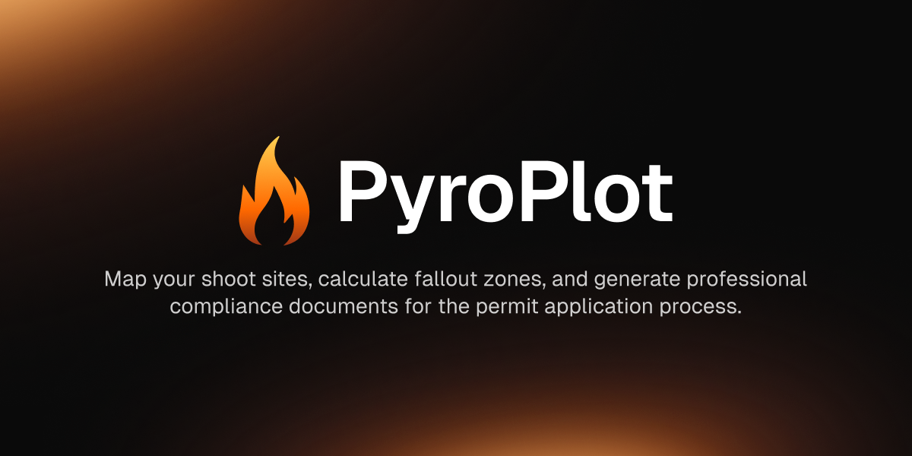
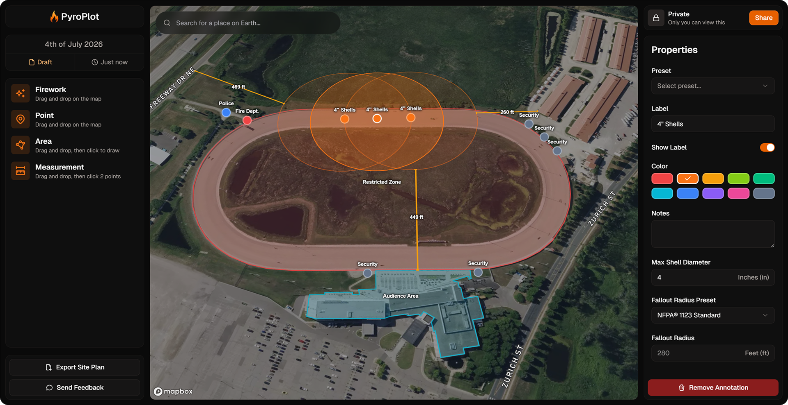

# Welcome to Pyro Plot

Pyro Plot is a web-based planning tool designed specifically for professional pyrotechnicians and firework display companies. It streamlines the permit application process by helping you create accurate site plans, calculate safety zones, and generate professional documentation required by local authorities.

{/* TODO: Add hero screenshot of the Pyro Plot interface showing a mapped project */}

## Who Is Pyro Plot For?

Pyro Plot is built for:

- **Professional Pyrotechnicians** planning firework displays of any size
- **Display Companies** managing multiple shows and client projects
- **Licensed Operators** who need to submit permit applications and compliance documentation
- **Anyone** who needs to create accurate site plans with safety calculations

Whether you're planning a small community event or a large-scale professional display, Pyro Plot helps you work faster and more accurately.

## Why Use Pyro Plot?

### Streamline Your Permit Workflow

Say goodbye to manual calculations and hand-drawn site plans. Pyro Plot automates the time-consuming parts of permit preparation, letting you focus on what matters most—creating spectacular shows.

### Professional, Accurate Documentation

Generate site plans that meet regulatory requirements with:

- **Automatic fallout zone calculations** based on NFPA 1123 standards
- **Precise distance measurements** between launch points and structures
- **Professional PDF exports** ready to submit with your permit applications
- **Clear visual layouts** that authorities can easily understand

{/* TODO: Add screenshot of a sample exported site plan PDF */}

### Interactive Site Mapping

Plot your entire display site with an intuitive drag-and-drop interface:

- **Firework Launch Points** with customizable fallout zones based on shell size
- **Area Markers** for audience zones, parking areas, and restricted spaces
- **Point Markers** for structures, landmarks, and points of interest
- **Measurement Tools** to verify safety distances and clearances

Work in imperial or metric units, and everything converts automatically.

### Stay Organized

Keep all your projects, documentation, and crew information in one secure place:

- Manage multiple shows simultaneously
- Store and organize project documents
- Maintain crew certifications and contact details
- Share plans with clients or authorities via secure links

## Get Started

Ready to simplify your firework display planning? Create your first project and experience how Pyro Plot can transform your permit workflow.

<Card
  title="Create Your First Project"
  icon="rocket"
  href="/getting-started/create-project"
>
  Learn how to set up a new firework display project
</Card>
